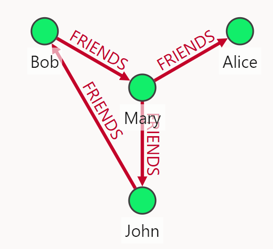
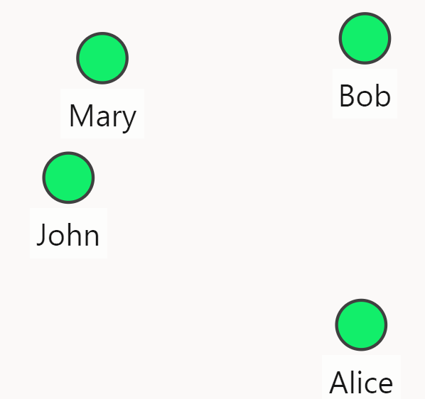
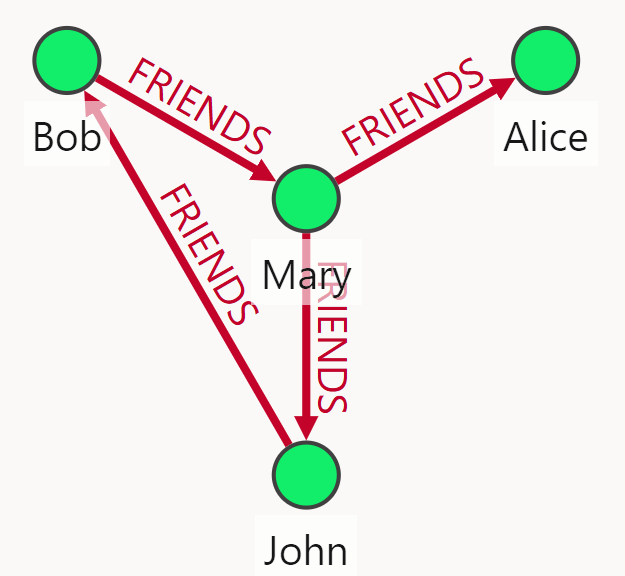
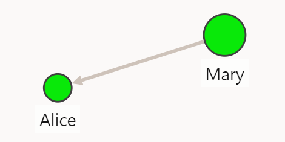
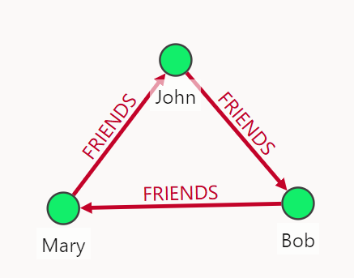

SQL/PGQ 그래프 쿼리 

이 쿼리 예제는 Oracle Property Graph Release 24.4 with oracle 23.8을 기준으로 작성됐습니다. 

그래프 개정 준비

DB 계정 신규 생성 또는 기존 사용중인 계정을 사용할 수 있다.

```sql

# 계정 생성

create user graphuser identified by graphuser default tablespace users;
alter user graphuser quota unlimited on users;

# 개발자 권한 부여 
grant DB_DEVELOPER_ROLE to graphuser;

```

그래프 생성 롤 부여

```sql
GRANT CREATE PROPERTY GRAPH to graphuser;

# 아래 권한은 PGX 사용을 위한 권한들임. privilege 생성은 관련 문서 참조 바람(https://docs.oracle.com/en/database/oracle/property-graph/25.2/spgdg/user-authentication-and-authorization.html#GUID-FE3E0493-D720-4215-A28C-00F03F3BE5D6)

GRANT GRAPH_DEVELOPER, GRAPH_USER to graphuser;
GRANT PGX_SESSION_ADD_PUBLISHED_GRAPH TO graphuser;

```

샘플 데이터 준비

```sql
CREATE TABLE university (
    id NUMBER GENERATED ALWAYS AS IDENTITY (START WITH 1 INCREMENT BY 1),
    name VARCHAR2(10),
    CONSTRAINT u_pk PRIMARY KEY (id));

INSERT INTO university (name) VALUES ('ABC');
INSERT INTO university (name) VALUES ('XYZ');
commit;

CREATE TABLE persons (
     person_id NUMBER GENERATED ALWAYS AS IDENTITY (START WITH 1 INCREMENT
     BY 1),
     name VARCHAR2(10),
     birthdate DATE,
     height FLOAT DEFAULT ON NULL 0,
     hr_data JSON,
     CONSTRAINT person_pk PRIMARY KEY (person_id)
   );

INSERT INTO persons (name, height, birthdate, hr_data)
       VALUES ('John', 1.80, to_date('13/06/1963', 'DD/MM/YYYY'), '{"department":"IT","role":"Software Developer"}');

INSERT INTO persons (name, height, birthdate, hr_data)
       VALUES ('Mary', 1.65, to_date('25/09/1982', 'DD/MM/YYYY'), '{"department":"HR","role":"HR Manager"}');

INSERT INTO persons (name, height, birthdate, hr_data)
       VALUES ('Bob', 1.75, to_date('11/03/1966', 'DD/MM/YYYY'), '{"department":"IT","role":"Technical Consultant"}');

INSERT INTO persons (name, height, birthdate, hr_data)
       VALUES ('Alice', 1.70, to_date('01/02/1987', 'DD/MM/YYYY'), '{"department":"HR","role":"HR Assistant"}');
commit;

CREATE TABLE student_of (
      s_id NUMBER GENERATED ALWAYS AS IDENTITY (START WITH 1 INCREMENT BY 1),
      s_univ_id NUMBER,
      s_person_id NUMBER,
      subject VARCHAR2(10),
      CONSTRAINT stud_pk PRIMARY KEY (s_id),
      CONSTRAINT stud_fk_person FOREIGN KEY (s_person_id) REFERENCES persons(person_id),
      CONSTRAINT stud_fk_univ FOREIGN KEY (s_univ_id) REFERENCES university(id)
    );

INSERT INTO student_of(s_univ_id, s_person_id,subject) VALUES (1,1,'Arts');
INSERT INTO student_of(s_univ_id, s_person_id,subject) VALUES (1,3,'Music');
INSERT INTO student_of(s_univ_id, s_person_id,subject) VALUES (2,2,'Math');
INSERT INTO student_of(s_univ_id, s_person_id,subject) VALUES (2,4,'Science');
commit;

CREATE TABLE friends (
    friendship_id NUMBER GENERATED ALWAYS AS IDENTITY (START WITH 1 INCREMENT BY 1),
    person_a NUMBER,
    person_b NUMBER,
    meeting_date DATE,
    CONSTRAINT fk_person_a_id FOREIGN KEY (person_a) REFERENCES persons(person_id),
    CONSTRAINT fk_person_b_id FOREIGN KEY (person_b) REFERENCES persons(person_id),
    CONSTRAINT fs_pk PRIMARY KEY (friendship_id)
);

INSERT INTO friends (person_a, person_b, meeting_date) VALUES (1, 3, to_date('01/09/2000', 'DD/MM/YYYY'));
INSERT INTO friends (person_a, person_b, meeting_date) VALUES (2, 4, to_date('19/09/2000', 'DD/MM/YYYY'));
INSERT INTO friends (person_a, person_b, meeting_date) VALUES (2, 1, to_date('19/09/2000', 'DD/MM/YYYY'));
INSERT INTO friends (person_a, person_b, meeting_date) VALUES (3, 2, to_date('10/07/2001', 'DD/MM/YYYY'));
commit;
```

그래프 생성

그래프의 노드, 엣지를 위한 데이터는 persons, university, friends, students_of 테이블을 원천 데이터로 그래프(일명 그래프 뷰)를 만들 것이다. 
원천 테이블의 관계(Relational)는 persons 테이블과 student_of 테이블의 persons.person_id 키로 연결된 Patent-child 관계를 가지며, person 테이블과 friends 테이블도 persons.person_id 키로 연결된 Parent_child 관계를 가진다. university 테이블과 students_of 테이블 간에도 university.id 키로 연결되는 구조를 가진다.  

students_graph 그래프는 parent 테이블인 persons와 university 테이블의 테이터를 노드셋으로, child 테이블인 friends, students_of 테이블의 데이터를 엣지셋으로 가지는 그래프로 만들어진다. persons 테이블의 데이터는 다시 person_id, name, dob(birthdata 컬럼의 알리아스) 속성을 가진 person 노드셋과 height 속성을 가진 person_ht 노드셋을 가진다. 하나의 원천 테이블을 2개 이상의 노드셋으로 나눌때 "LABEL" 지정 방법을 통해 나누 수 있다.
students_graph 그래프의 엣지셋은 friendship_id, meeting_date 속성을 갖는 friends 엣지셋과 subject 속성을 갖는 students_of 엣지셋을 가진다. friends 엣지셋은 person_a에서 person_b로 가는 방향을 가지며 이 관계는 원본 테이블의 P-C 관계를 참조할 수 있도록 지정해준다. 
students_of 엣지셋은 s_person_id에서 s_univ_id로 가는 방향을 가지며 이 경우도 역시 원본 테이블의 P-C 관계를 참조할 수 있도록 지정해준다.

```sql
CREATE PROPERTY GRAPH students_graph
  VERTEX TABLES (
    persons KEY (person_id)
      LABEL person
        PROPERTIES (person_id, name, birthdate AS dob)
      LABEL person_ht
        PROPERTIES (height),
    university KEY (id)
  )
  EDGE TABLES (
    friends
      KEY (friendship_id)
      SOURCE KEY (person_a) REFERENCES persons(person_id)
      DESTINATION KEY (person_b) REFERENCES persons(person_id)
      PROPERTIES (friendship_id, meeting_date),
    student_of
      KEY (s_id)
      SOURCE KEY (s_person_id) REFERENCES persons(person_id)
      DESTINATION KEY (s_univ_id) REFERENCES university(id)
      PROPERTIES (subject)
  );
```

그래프 객체 관리

오라클 속성 그래프의 그래프는 오라클 내에서 관리되며 딕셔너리 뷰를 통해 검색 할수 있다.

- USER_PROPERTY_GRAPHS
- USER_PG_ELEMENTS
- USER_PG_ELEMENT_LABELS
- USER_PG_LABELS
- USER_PG_EDGE_RELATIONSHIPS
- USER_PG_KEYS
- USER_PG_PROP_DEFINITIONS 


그래프 공유

오라클 속성 그래프는 다른 유저와 공유할 수 있다. 공유를 희망하는 그래프 객체를 다른 계정에개 읽기 권한을 주는 것 만으로 가능하다.

```sql
GRANT SELECT ON PROPERTY GRAPH students_graph TO scott;
```

SQL/PGQ 그래프 구문 및 함수

이 세션에서는 오라클 속성그래프에서 사용할 수 있는 다양한 검색 패턴, 함수 등 SQL/PGQ 쿼리 구문을 예제와 함께 소개한다.  

기본 그래프 쿼리 구문 및 패턴

노드 패턴과 노드 패턴 변수

SQL/PGQ에서는 식별자 * 자를 사용하여 노드의 전체 속성 값을 반환할 수 있다. SQL의 컬럼절에 사용되는 * 와 유사하다. 아래 쿼리는 노드 패턴 및 노드 패턴 변수를 사용한 기본 검색 쿼리이다. 첫 번째 쿼리는 students_graph 그래프에서 모든 노드들과 노드의 속성값을 출력한다.  노드 패턴은 "()"와 같이 괄호를 사용하여 노드 패턴을 기술한다. 아울러 노드 패턴 내에서 "IS" 를 사용하여 그래프 셋에서 특정 노드셋으로 제한하는 필터링을 사용할 수 있다. 이를 노트 패턴 변수라고 한다.

```sql

select * from graph_table(students_graph
match (x)
columns (x.*))
;

 PERSON_ID NAME       DOB          HEIGHT         ID
---------- ---------- -------- ---------- ----------
         1 John       63/06/13        1.8
         2 Mary       82/09/25       1.65
         3 Bob        66/03/11       1.75
         4 Alice      87/02/01        1.7
           ABC                                     1
           XYZ                                     2

select * from graph_table(students_graph
match (x is person)
columns (x.*))
;

 PERSON_ID NAME       DOB          HEIGHT
---------- ---------- -------- ----------
         1 John       63/06/13        1.8
         2 Mary       82/09/25       1.65
         3 Bob        66/03/11       1.75
         4 Alice      87/02/01        1.7


select * from graph_table(students_graph
match (x is person)
columns (x.name as person_x, x.dob as Birthday))
;

PERSON_X   BIRTHDAY
---------- --------
John       63/06/13
Mary       82/09/25
Bob        66/03/11
Alice      87/02/01

```
엣지 패턴과 엣지 패턴 변수

SQL/PGQ에서는 식별자 * 자를 사용하여 엣지의 전체 속성 값을 반환할 수 있다. SQL의 컬럼절에 사용되는 * 와 유사하다. 아래 쿼리는 엣지 패턴 및 엣지 패턴 변수를 사용한 기본 검색 쿼리이다. 첫 번째 쿼리는 students_graph 그래프에서 모든 엣지들과 엣지의 속성값을 출력한다.  엣지 패턴은 "[]"와 같이 중괄호를 사용하여 엣지 패턴을 기술한다. 아울러 엣지 패턴 내에서 "IS" 를 사용하여 그래프 셋에서 특정 엣지셋으로 제한하는 필터링을 사용할 수 있다. 이를 엣지 패턴 변수라고 한다. 또한 SQL/PGQ에서는 다양한 엣지 패턴을 지원한다. 차근차근 예제와 함께 살펴보도록 할 것이다.

```sql
select * from graph_table(students_graph
match [e is friends]
columns (e.*))
;

ORA-40987: GRAPH_TABLE 연산자에서 경로 패턴이 지정되지 않았습니다

select * from graph_table(students_graph
match -[e is friends]-
columns (e.*))
;

FRIENDSHIP_ID MEETING_
------------- --------
            1 00/09/01
            2 00/09/19
            3 00/09/19
            4 01/07/10
            1 00/09/01
            2 00/09/19
            3 00/09/19
            4 01/07/10


select * from graph_table(students_graph
match -[e is friends]-
columns (e.meeting_date))
;

MEETING_
--------
00/09/01
00/09/19
00/09/19
01/07/10
00/09/01
00/09/19
00/09/19
01/07/10

```

L2R(-[]->) 방향 엣지 패턴

속성 그래프는 엣지를 기준으로 기준 노드에서 오른쪽 노드로 연결되는 경로패턴을 검색할 수 있다. 일명 단방향 패턴을 의미한다. 아래 쿼리의 첫 번째 쿼리는 L2R(Left to Right) 경로를 갖는 패턴을 검색하는 쿼리이다. 
조건절을 넣지 않았기 때문에 노드 세트 중에서도 person 노드셋에서 friends 관계(엣지)를 가진 모든 L2R 관계인 결과를 반환한다. WHERE 조건절을 사용하면 보다 구체적인 조건으로 검색할 수 있다. 두번째 쿼리는 Mary가 알고 있는 사람을 모두 찾아줘로 해석할 수 있는 패턴 쿼리이다. 세번째 쿼리는 Mary와 Alice가 관계가 있는가에 대한 결과를 얻을 수 있는 쿼리이다.

```sql
select * from graph_table(students_graph
match (a is person)-[e is friends]->(b is person)
columns (a.name as pseson_a, e.meeting_date as 만난날, b.name as person_b)
);

PSESON_A   만난날   PERSON_B
---------- -------- ----------
Mary       00/09/19 John
Bob        01/07/10 Mary
John       00/09/01 Bob
Mary       00/09/19 Alice

SELECT * FROM GRAPH_TABLE (students_graph
  MATCH
  (a IS person where a.name= 'Mary') -[e IS friends]-> (b IS person)
  COLUMNS (a.name AS person_a, b.name AS person_b)
);

PERSON_A   PERSON_B
---------- ----------
Mary       Alice
Mary       John

SELECT * FROM GRAPH_TABLE (students_graph
  MATCH
  (a IS person where a.name= 'Mary') -[e IS friends]-> (b IS person where b.name = 'Alice')
  COLUMNS (a.name AS person_a, b.name AS person_b)
);

PERSON_A   PERSON_B
---------- ----------
Mary       Alice

```

PGX 환경에서 GUI 그래프 형태로 표현 하려면 vertex_id, edge_id 함수를 사용하면 된다. 두 함수의 사용법은 뒤에서 다룰 것이다.

```sql
select * from graph_table(students_graph
match (a is person)-[e is friends]->(b is person)
columns (vertex_id(a) as pseson_a, edge_id(e) as 만난날, vertex_id(b) as person_b)
);

```
</img>

columns 절에 명시한 출력 속성들을 select 절에 명시적으로 추가함으로써 결과 반환을 조절할 수 있다. 

```sql
select pseson_a, person_b from graph_table(students_graph
match (a is person)-[e is friends]->(b is person)
columns (a.name as pseson_a, e.meeting_date as 만난날, b.name as person_b)
);

PSESON_A   PERSON_B
---------- ----------
Mary       John
Bob        Mary
John       Bob
Mary       Alice

```

엣지를 생략한 검색 쿼리도 가능하다.

```sql
select * from graph_table(students_graph
match (a is person)->(b is person)
columns(a.name as person_a, b.name as person_b))
; 

PERSON_A   PERSON_B
---------- ----------
Mary       John
Bob        Mary
John       Bob
Mary       Alice
```

```sql
select * from graph_table(students_graph
match (a is person)->(b is person)
columns(vertex_id(a) as person_a, vertex_id(b) as person_b))
;
```

</img>


R2L(<-[]-) 방향 엣지 패턴

엣지를 기준으로 오른쪽에서 왼쪽으로 가는 방향성을 가진 패턴을 검색할 수 있다. 이 또한 짝사랑 패턴 또는 치사랑 패턴일 수 이다. 

```sql

select * from graph_table(students_graph
match (a is person)<-[e is friends]-(b is person)
columns (a.name as pseson_a, e.meeting_date as 만난날, b.name as person_b)
);

PSESON_B   만난날   PERSON_A
---------- -------- ----------
John       00/09/01 Bob
Mary       00/09/19 Alice
Mary       00/09/19 John
Bob        01/07/10 Mary

select * from graph_table(students_graph
match (a is person)<-[e is friends]-(b is person)
columns (vertex_id(b) as pseson_b, edge_id(e) as 만난날, vertex_id(a) as person_a)
);

```

</img>

Any-Directed(-[]-) 엣지 패턴

방향성이 없는 모든 관계 패턴 검색을 지원한다. 다음 패턴 쿼리는 friends와 연결된 모든 노드들을 검색하는 쿼리이다. 패턴절에 조건식을 넣어서 필터링이 가능하다.

```sql

SELECT * FROM GRAPH_TABLE (students_graph
  MATCH
  (a IS person) -[e IS friends]-(b IS person)
  COLUMNS (a.name AS person_a,e.meeting_date as 만난날, b.name AS person_b)
);

PERSON_A   만난날   PERSON_B
---------- -------- ----------
Bob        00/09/01 John
Alice      00/09/19 Mary
John       00/09/19 Mary
Mary       01/07/10 Bob
Mary       00/09/19 John
Bob        01/07/10 Mary
John       00/09/01 Bob
Mary       00/09/19 Alice

SELECT * FROM GRAPH_TABLE (students_graph
  MATCH
  (a IS person) -[e IS friends] - (b IS person WHERE b.name='Alice' OR b.name='Mary')
  WHERE (a.name='Alice' OR a.name='Mary')
  COLUMNS (a.name AS person_a, b.name AS person_b)
);

```
</img>


패턴 변수(Anonymous elements Variable)를 생략한 쿼리

노드, 엣지 패턴에 패턴변수를 지정하지 않는 어노니머스 패턴을 가진 패턴 검색이 가능하다. 아래 첫번째 쿼리는 엣지 패턴변수를 생략한 경우이다. 이 경우에 그래프의 모든 엣지를 검색 범위로 하는 관계 패턴을 검색하게 된다.  
노드a, 노드b와 관계가 있는 모든 패턴이 결과로 반환된다. 두번째 패턴에는 모든 엣지를 검색 범위로하는 관계 패턴을 검색한 쿼리이다. 

```sql
select * from graph_table(students_graph
match (a is person)-[]->(b is person)
columns (a.name as person_a, b.name as person_b)
);

PERSON_A   PERSON_B
---------- ----------
Mary       John
Bob        Mary
John       Bob
Mary       Alice


select * from graph_table(students_graph
match (a is person)-[e]->(b is person)
columns (a.name as person_a, b.name as person_b)
);

PERSON_A   PERSON_B
---------- ----------
Mary       John
Bob        Mary
John       Bob
Mary       Alice

```

복수 경로 (a)->(b),(a)->(c) 패턴 쿼리

복수 경로 패턴을 동시에 검색할 수 있는 복구 경로 패턴을 지원한다. MATCH 절 패턴절에 쉼표(,)로 구분하여 여러 개의  검색 패턴을 기술할 수 있다.
아래 첫번째 쿼리의 경우는 a 노드 패턴을 공유하는 2개의 패턴을 기술하였다. a는 그래프 패턴의 각 요소 패턴에서 동일한 그래프 요소 테이블에 바인딩되어야 한다. 따라서 이러한 반복되는 그래프 패턴 변수에는 암묵적인 자연 내부 조인이 적용된다. 
두 번째 쿼리는 두 경로 패턴 간에 공유 변수가 없는 경우이며 이 경우의 결과 출력 집합은 개별 경로 패턴의 교차곱이 반환된다.

```sql
SELECT * FROM GRAPH_TABLE (students_graph
  MATCH
  (a IS person WHERE a.name = 'John') -> (b IS person),(a IS person WHERE a.name = 'John') -> (c IS university)
  COLUMNS (a.name AS person_a, b.name AS person_b,c.name as university)
  );
; 

PERSON_A   PERSON_B   UNIVERSITY
---------- ---------- ----------
John       Bob        ABC

SELECT * FROM GRAPH_TABLE (students_graph
MATCH (a IS person WHERE a.name='John') -[IS student_of]-> (b IS university),
(x IS person) -[IS friends]-> (y IS person)
COLUMNS (a.name AS a, b.name as university, x.name AS x, y.name as y)
);

A          UNIVERSITY X          Y
---------- ---------- ---------- ----------
John       ABC        Mary       John
John       ABC        Bob        Mary
John       ABC        John       Bob
John       ABC        Mary       Alice

```

순환 경로 (a)-[]->(b)-[]->(c)-[]->(a) 패턴

순환 경로 패턴 검색을 지원한다.  (a IS person)-[e is friends]->( a is person) 이 패턴과 같이  a노드 자신에 연결되는 엣지를 갖는 패턴 즉, 사이클 패탄을 지원한다.
아래 예제는 3개의 단계를 거쳐 노드x 자신과 friende 관계로 연결되는 경로에 있는 노드를 찾는 쿼리이다.  

```sql
select x,y,z,x from graph_table(students_graph
match (x is person)-[is friends]->(y is person)-[is friends]->(z is person)-[is friends]->(x is person)
columns(x.name as x, y.name as y, z.name as z)
);

X          Y          Z          X
---------- ---------- ---------- ----------
Bob        Mary       John       Bob
John       Bob        Mary       John
Mary       John       Bob        Mary

select * from graph_table(students_graph
match (x is person)-[e1 is friends]->(y is person)-[e2 is friends]->(z is person)-[e3 is friends]->(x is person)
columns(vertex_id(x) as from_x,edge_id(e1) as Meet1, vertex_id(y) as y,edge_id(e2) as Meet2, vertex_id(z) as z,edge_id(e3) as Meet3,vertex_id(x) as to_x)
);

```

</img>

레이블 분리(Label Disjunction) 및 접속사(Label Conjunction)

레이블 표현 구문에서 분리 구분자 "|"를 지원한다. 구분자는 노드 패턴, 엣지 패턴 모든 절에 사용이 가능하다. 이 구분자는 OR 논리합 결과를 반환하는데 사용된다. 
아래 첫번째 쿼리 예는 students_graph 그래프에서 person과 univercity 레이블 갖는 모든 노드를 출력하는데 레이블 분리 구분자를 사용한다.
두번째, 새번째 쿼리는 접속자를 사용한 쿼리로 두개의 노드 셋의 속성값을 반환한다. 

```sql
select * from graph_table(students_graph
match (x is person|university)
columns(x.name as x, x.dob as x_date)
);

X          X_DATE
---------- --------
John       63/06/13
Mary       82/09/25
Bob        66/03/11
Alice      87/02/01
ABC
XYZ

SELECT * FROM GRAPH_TABLE (students_graph
MATCH
(x IS person), (x IS person_ht)
COLUMNS (x.name as name, x.dob as dob, x.height as height )
);

NAME       DOB          HEIGHT
---------- -------- ----------
John       63/06/13        1.8
Mary       82/09/25       1.65
Bob        66/03/11       1.75
Alice      87/02/01        1.7

select * from graph_table(students_graph
match 
(x is person),(y is university)
columns(x.name as p_name, y.name as Uname)
);

P_NAME     UNAME
---------- ----------
John       ABC
Mary       ABC
Bob        ABC
Alice      ABC
John       XYZ
Mary       XYZ
Bob        XYZ
Alice      XYZ


```

범위 한정자를 사용한 재귀경로 패턴

범위 한정자로 {n},{,m},{n,m}을 지원한다. n, m은 10진수 숫자를 지정한다. {2} 인경우 2개 범위를 말하며, {0,2} 경우는 0, 1,2를 {2,6} 2,3,4,5,6 까지의 모든 범위를 의미한다.
아래의 쿼리는 다양한 범위 한정자를 사용한 쿼리 예제와 반환 결과를 보여준다. 첫 예제는 person 노드 셋에서 Mary와 freiends 관계를 가진 사람중에서 2단계 경로(홉)을 가진 대상을 찿는 검색 쿼리로써 친구의 친구를 찾는 쿼리이다. 
세번째 쿼리는 직접 연결 경로(1호1), 2단계 경로(2홉) 모두를 찾는 검색 쿼리와 결과를 보여준다. 
  
```sql
# q1
SELECT * FROM GRAPH_TABLE (students_graph
MATCH (x is person WHERE x.name = 'Mary' ) -[is friends]->{2} (y is person)
COLUMNS (x.name AS x , y.name AS y)
);

X          Y
---------- ----------
Mary       Bob

# q2
SELECT * FROM GRAPH_TABLE (students_graph
MATCH (x is person WHERE x.name = 'Mary' ) -[e is friends]->{2} (y is person)
COLUMNS (x.name AS x , y.name AS y, count(e.friendship_id) as PATH)
);

X          Y                PATH
---------- ---------- ----------
Mary       Bob                 2

# q3
SELECT * FROM GRAPH_TABLE (students_graph
MATCH (x is person WHERE x.name='Mary') -[is friends]->{1, 2} (y is person)
COLUMNS (x.name AS x , y.name AS y)
); 

X          Y
---------- ----------
Mary       Alice
Mary       John
Mary       Bob

# q4
SELECT * FROM GRAPH_TABLE (students_graph
MATCH (x is person WHERE x.name='Mary') -[e is friends]->{1, 2} (y is person)
COLUMNS (x.name AS x , y.name AS y, count(e.friendship_id) as PATH)
);

X          Y                PATH
---------- ---------- ----------
Mary       Alice               1
Mary       John                1
Mary       Bob                 2

# q5
SELECT * FROM GRAPH_TABLE (students_graph
MATCH (x is person WHERE x.name='Mary') -[is friends]->{,2} (y is person)
COLUMNS (x.name AS x , y.name AS y)
);

X          Y
---------- ----------
Mary       Mary
Mary       Alice
Mary       John
Mary       Bob

SELECT * FROM GRAPH_TABLE (students_graph
MATCH (x is person WHERE x.name='Mary') -[e is friends]->{,2} (y is person)
COLUMNS (x.name AS x , y.name AS y, count(e.friendship_id) as PATH)
);

# q5
X          Y                PATH
---------- ---------- ----------
Mary       Mary                0
Mary       Alice               1
Mary       John                1
Mary       Bob                 2

```

그래프 집계(Aggregation) 함수

SQL/PGQ는 오라클 DB에서 제공하는 다양한 집계함수를 사용할 수 있다. 뿐만 아니라 사용자가 만든 함수를 그래프 쿼리에 사용할 수 있다. 
집계함수는 COLUMNS 절 또는  패턴절의 WHERE 구분에 삽입하여 사용할 수 있다.

아래 첫번째 예제는 LISTAGG, AVG, COUNT 등의 집계함수를 사용한 예제이다. 매칭되는 패턴 결과의 속성값을 LISTAGG 함수로 묶어서 f.name, age_list 속성값을 쉼표로 구분하여 한줄로 출력하고 있다.
역시 AVG 함수를 사용하여 매칭되는 패턴 결과의 평균 나이를 계산하여 반환한다. 두번째 예제에는 JSON 형태로파싱하는 JSON_ARRAYAGG 함수를 사용하여 패턴 매칭 결과를 JSON 형태로 반한하고 있다.
오라클 DB에서 지원하는 집계 함수 종류는 오라클 SQL Language Guide의 Aggregate Functions 세션을 참고바란다.

SQL Language Guide : https://docs.oracle.com/en/database/oracle/oracle-database/23/sqlrf/Aggregate-Functions.html#GUID-62BE676B-AF18-4E63-BD14-25206FEA0848

```sql

SELECT * FROM GRAPH_TABLE ( students_graph
MATCH (p IS person) (-[e IS friends]-> (f IS person)
WHERE p.person_id <> f.person_id){2,3}
WHERE p.name = 'John'
COLUMNS (LISTAGG(f.name, ',') as fnames,
         LISTAGG(EXTRACT(YEAR from SYSDATE) - EXTRACT(YEAR from f.dob), ',') AS age_list,
         AVG(EXTRACT(YEAR from SYSDATE) - EXTRACT(YEAR from f.dob)) AS avg_age_group,
         COUNT(e.friendship_id) AS path));

FNAMES               AGE_LIST                       AVG_AGE_GROUP       PATH
-------------------- ------------------------------ ------------- ----------
Bob,Mary             59,43                                     51          2
Bob,Mary,Alice       59,43,38                          46.6666667          3

SELECT * FROM GRAPH_TABLE ( students_graph
MATCH (u1 IS university) -[e]-{,3} (u2 IS university)
WHERE u1.name = 'ABC' AND u2.name = 'XYZ'
COLUMNS (JSON_ARRAYAGG(CASE WHEN e.subject IS NOT NULL THEN e.subject                         
                       ELSE CAST(e.friendship_id AS VARCHAR(100)) END) AS path));

PATH
--------------------------------------------------------------------------------
["Arts","3","Math"]
["Music","4","Math"]

```

바인드 변수 사용 쿼리
```sql
variable name VARCHAR2(10);

BEGIN
  :name := 'Bob';
END;
/

SELECT * FROM GRAPH_TABLE (students_graph
  MATCH
  (a IS person) -[e IS friends]-> (b IS person WHERE b.name=:name)
  WHERE a.name='John'
  COLUMNS (a.name AS person_a,
           b.name AS person_b,
           e.meeting_date AS met_on)
);

PERSON_A   PERSON_B   MET_ON
---------- ---------- --------
John       Bob        00/09/01

```

MATCHNUM 함수

패턴 매칭 결과 집합에서 메칭 항목을 식별할 수 있는 숫자값을 반환한다. ONE ROW PER VERTEX 및 ONE ROW PER STEP을 지정하지 않으면 고유한 일련 번호를 가지며 지정된 경우 일치 항목내 여러 반복에 대해 동일한 일치 번호가 반환된다. SQL/PGQ 쿼리 절에서만 사용 가능하다.


```sql

SELECT * FROM GRAPH_TABLE (students_graph
MATCH (p IS person)
COLUMNS (MATCHNUM() AS matchnum, p.name as Node_Name)
)
ORDER BY matchnum
;

  MATCHNUM NODE_NAME
---------- ----------
         1 John
         2 Mary
         3 Bob
         4 Alice

SELECT * FROM GRAPH_TABLE (students_graph
MATCH (p IS person where p.name = 'John')
COLUMNS (MATCHNUM() AS matchnum, p.name as Node_Name)
)
ORDER BY matchnum
/

  MATCHNUM NODE_NAME
---------- ----------
         1 John

SELECT * FROM GRAPH_TABLE (students_graph
MATCH (p IS person where p.name = 'Bob')
COLUMNS (MATCHNUM() AS matchnum, p.name as Node_Name)
)
ORDER BY matchnum
/

  MATCHNUM NODE_NAME
---------- ----------
         1 Bob

```

ELEMENT_NUMBER 함수

ONE ROW PER VERTEX 또는 ONE ROW PER STEP과 같은 반복자 변수와 같이 쓸 수 있는 함수로써 반복자 변수를 참조하여 해당 반복자 변수가 현재 바인딩된 엘리먼트 요소에 순차적인 번호를 반환하게 한다. 예를 들어 v1 -[e1]-> v2 -[e2]-> v3 와 같은 패턴이 있을 경우 v1:1, e1:2, v2:3, e2:4, v3:5와 같이 엘리먼트 번호가 순차적으로 붙는다고 볼수 있다.
ELEMENT_NUMBER 함수는 COLUMNS 절에만 쓸수 있으며, 반복자 변수 이외의 다른 유형의 변수를 참조할 수 없다.


```sql
SELECT * FROM GRAPH_TABLE ( students_graph
MATCH (p1 IS person) -[IS friends]-{1,2} (p2 IS person)
WHERE p1.name = 'John' AND p2.name = 'Mary'
ONE ROW PER STEP (v1, e, v2)
COLUMNS ( matchnum() AS matchnum,
          v1.name AS name1, ELEMENT_NUMBER(v1) as V1_Node_Num,
          e.friendship_id AS friendship_id, ELEMENT_NUMBER(e) AS Edge_Num,
          v2.name AS name2, ELEMENT_NUMBER(v2) AS V2_Node_Num)
)
ORDER BY matchnum, V1_Node_Num
/

  MATCHNUM NAME1      V1_NODE_NUM FRIENDSHIP_ID   EDGE_NUM NAME2      V2_NODE_NUM
---------- ---------- ----------- ------------- ---------- ---------- -----------
         1 John                 1             3          2 Mary                 3
         2 John                 1             1          2 Bob                  3
         2 Bob                  3             4          4 Mary                 5

```
PL/SQL 함수 호출 그래프 쿼리

오라클 SQL/PGQ는 사용자가 만든 PLSQL 함수와 결합하여 그래프 쿼리를 실행할 수 있다. 아래 예는 get_age라는 아니 계산 사용자 함수를 사용하여 쿼리를 실행하는 예이다.

```sql
CREATE OR REPLACE FUNCTION get_age(
    id NUMBER
)
RETURN NUMBER
AS
    age NUMBER := 0;
BEGIN
    -- get age
      SELECT (EXTRACT(YEAR from SYSDATE) - EXTRACT(YEAR from birthdate))
      INTO age 
      FROM persons
      WHERE person_id=id;
    -- return age
    RETURN age;
END;
/

SELECT * FROM GRAPH_TABLE (students_graph
  MATCH
   (a IS person) -[e IS friends]-> (b IS person)
  WHERE (get_age(a.person_id) > 50)
  COLUMNS (a.name AS a,
        get_age(a.person_id) AS age,
           b.name AS b,
           e.meeting_date AS met_on)
  );
  
  A                 AGE B          MET_ON
---------- ---------- ---------- --------
John               62 Bob        00/09/01
Bob                59 Mary       01/07/10

```
SCN, TimeStamp 연계 쿼리

그래프 쿼리에서도 SCN 또는 TIMESTAMP 기준으로 현재 또는 특정 과거 시점으로 돌아가 그 시점의 데이터를 기반으로 그래프를 조회할 수 있게 해준다. 

```sql
SELECT TIMESTAMP_TO_SCN(SYSDATE) FROM DUAL;

TIMESTAMP_TO_SCN(SYSDATE)
-------------------------
                  6929341


SELECT * FROM GRAPH_TABLE (students_graph AS OF SCN 6929341
  MATCH
   (a IS person) -[e]-> (b IS person)
  COLUMNS (a.name AS a, b.name AS b, e.meeting_date AS met_on)
  );
  
A          B          MET_ON
---------- ---------- --------
John       Bob        00/09/01
Mary       Alice      00/09/19
Mary       John       00/09/19
Bob        Mary       01/07/10

SELECT * FROM GRAPH_TABLE (students_graph AS OF TIMESTAMP SYSTIMESTAMP
  MATCH
   (a IS person WHERE a.name='John') -[e]-> (b IS person)
  COLUMNS (a.name AS a, b.name AS b, e.meeting_date AS met_on)
  );
  
A          B          MET_ON
---------- ---------- --------
John       Bob        00/09/01


```

VERTEX_ID 및 EDGE_ID 연계 쿼리

오라클 속성 그래프에서는 노드, 엣지를 고유하게 식별할 수 있는 고유 ID를 제공하며, 이 고유 ID값을 얻을 수 있는 함수가 VERTEX_ID, EDGE_ID함수이다.
이 함수는 그래프 엘리먼트의 고유ID값을 포함한 메타 정보를 JSON 형태로 결과를 반환한다. 이 기능을 사용하여 사용자 UI 화면을 더 풍부하게 만들 수 있을 것이다.
PGX 애플리케이션에서 이 VERTEX_ID와 EDGE_ID를 사용하여 GUI 형태의 그래프 결과를 볼 수 있다.

```sql
SELECT * FROM GRAPH_TABLE (students_graph
MATCH
 (a IS person ) -[e IS friends]-> (b IS person)
COLUMNS (JSON_SERIALIZE(VERTEX_ID(a)) AS id_a , JSON_SERIALIZE(EDGE_ID(e)) AS id_e)
);

ID_A
--------------------------------------------------------------------------------
ID_E
--------------------------------------------------------------------------------
{"GRAPH_OWNER":"GRAPHUSER","GRAPH_NAME":"STUDENTS_GRAPH","ELEM_TABLE":"PERSONS",
"KEY_VALUE":{"PERSON_ID":1}}
{"GRAPH_OWNER":"GRAPHUSER","GRAPH_NAME":"STUDENTS_GRAPH","ELEM_TABLE":"FRIENDS",
"KEY_VALUE":{"FRIENDSHIP_ID":1}}

{"GRAPH_OWNER":"GRAPHUSER","GRAPH_NAME":"STUDENTS_GRAPH","ELEM_TABLE":"PERSONS",
"KEY_VALUE":{"PERSON_ID":2}}
{"GRAPH_OWNER":"GRAPHUSER","GRAPH_NAME":"STUDENTS_GRAPH","ELEM_TABLE":"FRIENDS",
"KEY_VALUE":{"FRIENDSHIP_ID":2}}

{"GRAPH_OWNER":"GRAPHUSER","GRAPH_NAME":"STUDENTS_GRAPH","ELEM_TABLE":"PERSONS",
"KEY_VALUE":{"PERSON_ID":2}}
{"GRAPH_OWNER":"GRAPHUSER","GRAPH_NAME":"STUDENTS_GRAPH","ELEM_TABLE":"FRIENDS",
"KEY_VALUE":{"FRIENDSHIP_ID":3}}

{"GRAPH_OWNER":"GRAPHUSER","GRAPH_NAME":"STUDENTS_GRAPH","ELEM_TABLE":"PERSONS",
"KEY_VALUE":{"PERSON_ID":3}}
{"GRAPH_OWNER":"GRAPHUSER","GRAPH_NAME":"STUDENTS_GRAPH","ELEM_TABLE":"FRIENDS",
"KEY_VALUE":{"FRIENDSHIP_ID":4}}

SELECT * FROM GRAPH_TABLE (students_graph
MATCH
 (a IS person ) -[e IS friends]-> (b IS person)
COLUMNS (VERTEX_ID(a) AS id_a , EDGE_ID(e) AS id_e)
);

D_A
--------------------------------------------------------------------------------
ID_E
--------------------------------------------------------------------------------
{"GRAPH_OWNER":"GRAPHUSER","GRAPH_NAME":"STUDENTS_GRAPH","ELEM_TABLE":"PERSONS",
{"GRAPH_OWNER":"GRAPHUSER","GRAPH_NAME":"STUDENTS_GRAPH","ELEM_TABLE":"FRIENDS",

{"GRAPH_OWNER":"GRAPHUSER","GRAPH_NAME":"STUDENTS_GRAPH","ELEM_TABLE":"PERSONS",
{"GRAPH_OWNER":"GRAPHUSER","GRAPH_NAME":"STUDENTS_GRAPH","ELEM_TABLE":"FRIENDS",

{"GRAPH_OWNER":"GRAPHUSER","GRAPH_NAME":"STUDENTS_GRAPH","ELEM_TABLE":"PERSONS",
{"GRAPH_OWNER":"GRAPHUSER","GRAPH_NAME":"STUDENTS_GRAPH","ELEM_TABLE":"FRIENDS",

{"GRAPH_OWNER":"GRAPHUSER","GRAPH_NAME":"STUDENTS_GRAPH","ELEM_TABLE":"PERSONS",
{"GRAPH_OWNER":"GRAPHUSER","GRAPH_NAME":"STUDENTS_GRAPH","ELEM_TABLE":"FRIENDS",

``` 

VERTEX_EQUAL 사용 쿼리

이 함수는 각각 두 개의 노드 및 엣지 식별자를 비교하여 동일하면 TRUE를 반환한다.

```sql
SELECT * FROM GRAPH_TABLE (students_graph
MATCH
 (a IS person WHERE a.name='John') -[e IS friends]->{,1} (b IS person)
WHERE VERTEX_EQUAL(a,b)
COLUMNS (JSON_SERIALIZE(VERTEX_ID(a)) AS id_a , JSON_SERIALIZE(VERTEX_ID(b)) AS id_b)
);

ID_A
--------------------------------------------------------------------------------
ID_B
--------------------------------------------------------------------------------
{"GRAPH_OWNER":"GRAPHUSER","GRAPH_NAME":"STUDENTS_GRAPH","ELEM_TABLE":"PERSONS",
"KEY_VALUE":{"PERSON_ID":1}}
{"GRAPH_OWNER":"GRAPHUSER","GRAPH_NAME":"STUDENTS_GRAPH","ELEM_TABLE":"PERSONS",
"KEY_VALUE":{"PERSON_ID":1}}

```
------------------------------------------------------------------------------------