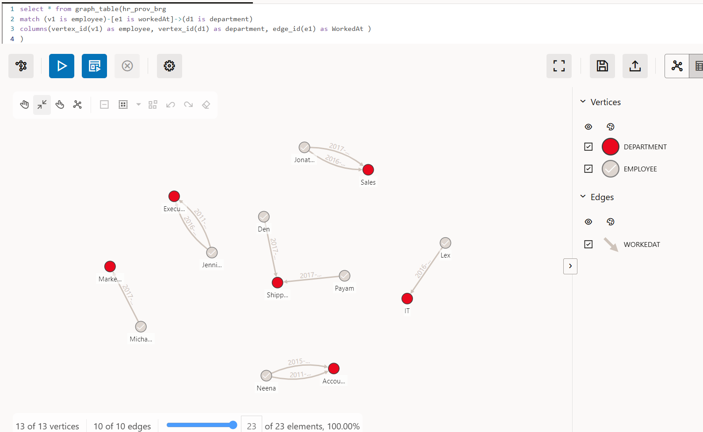
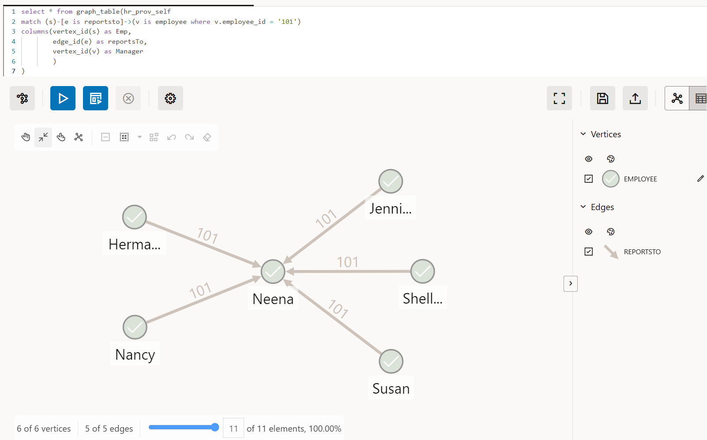
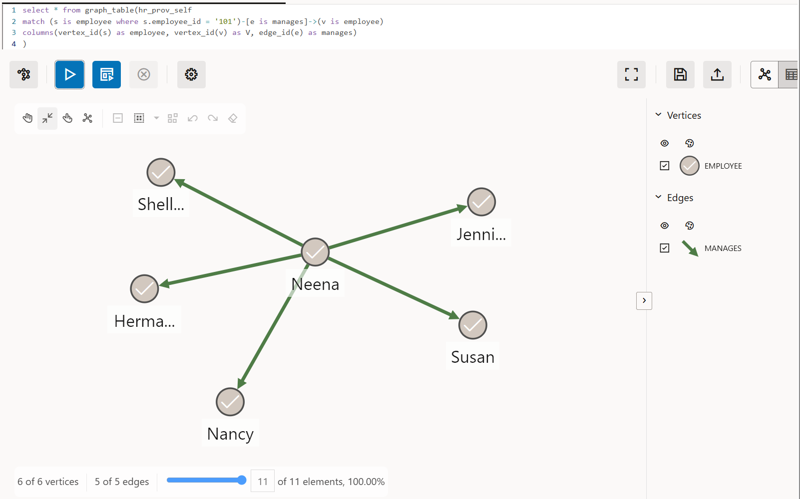

## 오라클 SQL/PGQ 그래프 설계(모델링) 방법

이 문서는 Oracle HR 스키마 데이터를 기반으로 SQL/PGQ 그래프(그래프뷰)의 생성을 위한 그래프 설계(모델링)방법을 알아보는데 중점을 두고 만들었습니다. 

## 1. 관련 소프트웨어 버전

1. 오라클 데이터베이스 23ai(23.8 이상) : free 버전 다운로드 및 설치
2. Oracle Instance Client 25.* 및 SQLPLUGIN 
3. Oracle HR 스키마 샘플데이터 임포트
4. Oracle Graph Visualization Application(V 25.3 이상) 다운로드 및 설치   -- 그래프 시각화 필요시

## 2. 그래프의 설계

### 테이블 및 테이블 간의 관계 파악

그래프 분석에 필요한 소스 데이터가 들어있는 스키마의 DB 객체들을 우선 파악해야한다. SQL/PGQ 그래프와 연결 가능한 대상 객체는 테이블, 시노님(Synonym), Externale Table이 가능하다. 객체와 객체 사이의 관계(Relational)를 파악하는 것이 설계의 첫 단추가 될것이다. 물론, 단일 객체만으로도 그래프 뷰를 만들어 그래프 쿼리를 실행할 수 있지만 관계형 DB에서 그런 경우는 드물 것이다. 따라서 가능한 객체들 간의 관계를 파악할 수 있으면 그래프 설계에 보다 쉽게 접근할수 있을 것이다. 

### 그래프명의 설계

그래프는 DB 내에서 고유의 이름을 가져야 한다. 그래프명은 스키마 내에서 다른 일반적인 DB 객체의 이름 지정방식과 다르지 않다. 원하는 그래프 명을 사용하면 되며 스키마 내에서 다른 그래프와 중복이 없도록 유일한 이름을 사용한다.

### 버텍스의 설계 

버텍스 테이블의 각 행은 그래프를 구성하는 버텍스(또 다른 명칭 : 정점 또는 노드)가 된다. 따라서 버텍스의 설계는 버텍스 테이블 설계로 구체화 된다. 버텍스 테이블은 앞에서 언급했듯이 DB의 원본 객체와 연결된다. DB 객체의 구조가 변경, 삭제 되는 경우 그래프 쿼리를 실행할 때 에러가 날수 있다. 에러가 있는 경우는 종속성 검증(Revalidating) 또는 그래프를 재생성 해준다. 

버텍스 테이블의 식별

그래프는 하나 이상의 버텍스 집합(sets)이 있어야 하기 때문에 버텍스(노드)가 되는 하나 이상의 버텍스 테이블을 지정해야 한다. 다음을 참고하여 버텍스 후보 테이블을 식별할 수 있다.
     
* 기본키(PK), 고유키(UK) 조건이 있는 컬럼 또는 그와 같은 요건의 컬럼이 있는 테이블 중에 참조가 많이 되는 테이블이 될수 있다. 
* 행 수가 많거나 외래키가 거의 없고 독립적이면 말단 엔티티 후보가 될 수 있다.
* 하나의 테이블에 복수 개의 버텍스 후보(PK와 그의 속성 정보 외에 고유 컬럼 조건으로 별도로 구분할 수 있을 경우)가 있을 수 있다.

버텍스 테이블의 지정 및 명세

* 버텍스 테이블은 기본적으로 DB 객체의 이름을 그대로 사용해야 하지만 필요에 따라서 “AS” 키워드를 사용하여 별칭을 지정하여 사용할 수 있다.
* 버텍스 테이블에 사용된 이름은 해당 속성 그래프 공간에서 관리되기 때문에 스키마 객체 이름이나 다른 속성 그래프에 정의된 그래프 엘리먼트 이름과는 충돌하지 않는다.
* 버텍스 테이블 이름은 대소문자를 구분하기 위해 따옴표로 묶을 수 있으며, 기본적으로 128자로 제한된다.
* 식별된 버텍스 후보 테이블을 기반으로 아래 방법을 참조하여 버텍스를 지정한다.
   * 키 없이 버텍스 테이블만 기술 가능 (그래프 생성 옵션이 Enforced Mode에서 키 값이 듀플이 있을 때는 에러 발생함)
   * 기본키(Primary key)와 함께 기술 가능
   * 복합키와 함께 기술 가 
   * 1개의 객체를 2개 이상으로 분리할 경우는 객체 이름을 AS(별칭)를 사용하여 다른 이름으로 지정하고 다른 키를 사용하여 지정

버텍스 키의 지정 및 유의 사항

* 버텍스 키는 그래프 내에서 버텍스를 고유하게 식별 할 수 있도록 하는 식별자로서 버텍스 테이블로 지정된 테이블의 기본키 또는 고유키 조건의 컬럼을 버텍스 키로 사용해야 한다.
* DB 객체에 지정된 기본키 또는 고유키 조건이 없는 경우, VERTEX TABLES 절의 KEY 절에 명시적으로 정의하여 버텍스 테이블의 기본키 컬럼을 지정해야 한다.
* 오라클DB에서 버텍스 테이블의 키 절이 생략될 경우에는 DB 객체의 기본키 또는 고유키 제약조건으로부터 자동으로 식별된다.
   * 두 가지 키 모두 존재하는 경우, PRIMARY KEY ->  UNIQUE 키 순으로 인식하게 된다.
   * 버텍스 테이블의 키가 고유키를 기반으로 자동 유추되는 경우, 해당 UNIQUE 키의 열은 NOT NULL이어야 한다.
   * DB 객체에 여러 개의 기본키 또는 고유키가 있는 경우 키 유추는 실패하고 에러를 발생한다.
* 객체의 제약조건(constraint)은 키를 유추하는 데만 사용되고 이 유추는 제약조건에 종속되지 않는다. 즉, 제약조건이 삭제되더라도 그래프에 영향을 주지 않는다. 
* DB객체와 그래프 간에 종속성이 필요한 경우(테이블-그래프 일관성 필요시) DDL 구문의 OPTIONS에 “ENFORCED MODE” 지정을 통하여 종속성 유지를 할 수 있다.
* 버텍스 키로 지정되는 컬럼 이름은 DB 객체의 컬럼 이름과 일치해야 한다.
* 복합 버텍스 키를 지원하며 최대 32개의 컬럼을 초과할 수 없다.

오라클 딕셔너리 정보를 이용한 그래프 객체 후보 식별
     
오라클 데이터베이스의 딕셔너리 정보를 이용하여 객체들간의 관계를 파악할 수 있으며, 각각의 관계와 그래프 객체 후보  특성을 이용하여 그래프 객체 후보들을 파악할 수 있다
아래 쿼리를 사용하여 엣지 후보 테이블과 키 찾기를 하는데 도움을 받을 수 있다.


* 버텍스 후보 테이블 찾기 쿼리

```sql
col TABLE_NAME format a30                     
col NUM_ROWS_EST format 999,999 
col PK_UK_DEFS format a30

SELECT t.table_name,  NVL(t.num_rows, -1)  AS num_rows_est,
    /* PK/UK 요약 */
  (
    SELECT DBMS_LOB.SUBSTR(RTRIM(XMLAGG(XMLELEMENT(e, x.def || ' | ')
          ORDER BY x.constraint_type, x.constraint_name).EXTRACT('//text()').getClobVal(),
               ' | ' ), 4000, 1 )
    FROM (
      SELECT uc.constraint_name, uc.constraint_type, uc.constraint_type || ':' ||
             LISTAGG(ucc.column_name, ',') WITHIN GROUP (ORDER BY ucc.position) AS def
      FROM   user_constraints  uc
      JOIN   user_cons_columns ucc
             ON ucc.constraint_name = uc.constraint_name
            AND ucc.owner          = uc.owner
      WHERE  uc.table_name = t.table_name
      AND    uc.constraint_type IN ('P','U')
      GROUP  BY uc.constraint_name, uc.constraint_type
    ) x
  )                                         AS pk_uk_defs,
  /* indeg: 다른 테이블이 이 테이블을 참조하는 FK 수 */
  (
    SELECT COUNT(*) FROM   user_constraints c
    JOIN   user_constraints pr
           ON pr.constraint_name = c.r_constraint_name
    WHERE  c.constraint_type = 'R'
    AND    pr.table_name     = t.table_name
  )                                         AS indeg_fk,
  /* outdeg: 이 테이블이 가진 FK 수 */
  (
    SELECT COUNT(*) FROM   user_constraints c
    WHERE  c.constraint_type = 'R'
    AND    c.table_name      = t.table_name
  )                                         AS outdeg_fk
FROM   user_tables t
ORDER  BY indeg_fk DESC, NVL(t.num_rows, -1) DESC, t.table_name;

TABLE_NAME                     NUM_ROWS_EST PK_UK_DEFS                       INDEG_FK  OUTDEG_FK
------------------------------ ------------ ------------------------------ ---------- ----------
EMPLOYEES                               107 P:EMPLOYEE_ID | U:EMAIL                 3          3
DEPARTMENTS                              27 P:DEPARTMENT_ID                         2          2
JOBS                                     19 P:JOB_ID                                2          0
COUNTRIES                                25 P:COUNTRY_ID                            1          1
LOCATIONS                                23 P:LOCATION_ID                           1          1
REGIONS                                   5 P:REGION_ID                             1          0
JOB_HISTORY                              10 P:EMPLOYEE_ID,START_DATE                0          3

``` 

버텍스 설계 예시

버텍스 설계 예시는 오라클 샘플 데이터의 HR 스키마를 사용한다. HR 스키마 객체에서 6개의 버텍스 후보 테이블과 테이블의 PK를 찾을 수 있다.  

```
employees KEY(employee_id)

departments KEY(department_id)

jobs KEY(job_id)

locations KEY(location_id)

countries KEY(country_id)

regions KEY(region_id)
```

### 엣지의 설계 

그래프의 엣지는 엣지 테이블의 각 행이 그래프의 엣지가 된다. 먼저 엣지 후보 테이블을 찾고, 엣지 테이블을 지정함으로써 엣지 설계가 시작된다.  

엣지 후보 테이블 식별

그래프에는 0개 이상의 엣지 집합(Sets)이 있을 수 있다. 엣지가 있는 그래프에는 하나 이상의 엣지 테이블을 지정해야 하기 때문에 DB 객체에서 엣지 후보를 찾아야 한다. 엣지 테이블 역시 DB의 객체이어야 한다. 
아래 조건을 참고하여 엣지 후보 테이블을 식별할 수 있다.

* 엣지 테이블에는 엣지를 유일하게 식별할 수 있는 키(기본키 또는 고유키 또는 이에 맞는 데이터 값 있는 컬럼)가 있어야 한다.  
* 외래키(Foreign Key)를 가진 DB 객체는 엣지 후보 테이블일 수 있다. 일반적으로 외래키(Foreign Key)는 엣지라고 볼수 있다. 
* 브릿지 테이블(외래키가 2개 이상, 자체 데이터 칼럼 적음)은 다대다의 엣지 후보 테이블일 수 있다.
* 자기참조 관계가 있는 기본 테이블은 테이블 자신이 엣지 테이블 후보일 수 있다. 자기참조 외래키는 내 위계/친구/팔로우 같은 엣지 후보일 수 있다.
* 트랜잭션 테이블(예: 주문)처럼 두 개 이상의 엔티티(N:M)를 동시에 참조하면 참조 테이블(트랜젝션 테이블) 자체가 엣지 후보 테이블일 수 있다.

엣지 테이블의 지정 및 명세

* 엣지 테이블(이름)은 버텍스 테이블(이름)과 중복 사용할 수 없다. 중복되는 경우 ＂AS＂를 사용하여 별칭을 지정하여야 한다.
* 엣지는 엣지 식별키, 출발지 버텍스와 목적지 버텍스로 구성된다. 따라서 엣지 테이블 절에는 기본적으로 엣지 식별 키절, SOURCE(출발 버텍스)절과 DESTINATION(목적지 버텍스)절을 명시해야 한다. 
한다.

엣지 테이블의 키 지정 및 유의 사항

* 엣지 테이블의 기본키는 각 엣지 하나하나를 식별하는 역할을 하는 키로서 그래프 탐색시 중복을 방지하는 역할을 한다. 따라서 엣지 테이블의 엣지 식별키는 기본키 또는 고유키가 된다. 기본 테이블에 기본키 또는 고유키 제약조건이 있는 경우에는 엣지 식별 키절은 생략할수 있다. 
* 엣지의 출발지, 목적지에 사용되는 버텍스 테이블은 버텍스 테이블 절에서 사용된 이름을 사용해야
* SOURCE 절과 DESTINATION 절에는 다음과 같은 3가지 요소를 포함한다.
   * 버텍스 테이블 이름 
   * 외래키로 처리할 엣지 테이블의 컬럼명(복합 키 경우 키 목록)
   * 참조된 키로 처리할 참조된 버텍스 테이블의 컬럼명(복합 키 경우 키 목록)
* SOURCE/DESTINATION KEY : 어떤 버텍스를 연결하는지 정의하는 키로서 그래프 구조를 보장하는 역할을 한다.
* 오라클에서 키절을 생략하면 그래프 생성시 디폴트로 SOURCE 키, DESTINATION 키 FOREIGN KEY 제약 조건으로부터 자동으로 가져온다.
* 오라클에서는 엣지 테이블의 키는 DB 객체의 PRIMARY KEY 또는 UNIQUE 키 제약 조건으로부터 자동으로 식별될 수 있도록 지원된다.
   * 두 가지 모두 존재하는 경우에는 PRIMARY KEY- > UNIQUE 키 순으로 인식된다.
   * 엣지 테이블 키가 UNIQUE 키를 기반으로 자동 유추되는 경우, 해당 UNIQUE 키의 열은 NOT NULL이어야 한다.
* DB 객체에 PRIMARY 키 또는 UNIQUE 키가 없는 경우, EDGE TABLES 절의 KEY 절에 명시적으로 지정해야 한다.
* 다음의 경우에는 KEY절에 명시적으로 키를 지정해야 한다.
  * 에지와 참조되는 버텍스 테이블 사이에 FOREIGN KEY 제약 조건이 없는 경우
  * 에지와 참조되는 버텍스 테이블 사이에 여러 개의 FOREIGN KEY 제약 조건이 있는 경우
  * 에지 테이블과 해당 소스 및 DESTINATION 버텍스(노드) 테이블의 RDB 객체가 Mview 또는 외부 테이블인 경우

엣지의 선택 및 방향성 지정 방법

그래프에서 방향성은 한 버텍스에서 다른 버텍스로의 이동, 흐름을 나타낸다. 방향성을 지정하는 것은 보다 더 정확한 분섯을 하는데 도움을 줄수 있다.예를 들어 소셜미디어에서 한 쪽만 Follow하는 경우에는 방향성을 지정해주면 보다 정확한 분석을 할 수 있을 것이다. 

그래프의 방향성 결정은 객체의 FK/PK 연결방향이 아니라 탐색 의도, 즉 질의의 목적으로 결정된다. SOURCE는 시작 버텍스, DESTINATION은 도착 버텍스를 나타낸다. 두 버텍스 관계가 양방향 대칭적이지 않을 경우에는 방향성을 지정해줘야 한다. 

다음은 객체 간의 다양한 관계 패턴 구조에서 엣지 테이블의 선택과 방향성을 지정하는 방법이다.

* N(자식):1(부모) 관계 패턴

객체의 관계에서 N:1 관계는 자식 테이블이 부모 PK를 참조하는 FK 컬럼을 가지는 특성이 있는 관계다. "직원은 어느부서 소속이다"와 같은 정방향(직원->부서) 관계 패턴을 탐색하는 경우에 해당한다. 
이 경우는 다음과 같이 버택스와 엣지를 설계할 수 있을 것이다.

* 버텍스 테이블 = 부모 테이블, 자식 테이블
* 버택스 = 버텍스 테이블의 PK를 기준으로 하는 각 로우
* 엣지 테이블 = 자식 테이블(FK 보유)
* 엣지(관계) = 엣지 테이블의 FK와 버택스 테이블의 PK
* 엣지명 = 임의의 관계명(의미 해석 할 수 있는 동명사나 동사 형태로 사용)
* 엣지 방향 : 의도에 따라 출발지 버택스, 목적지 버택스 의 키를 사용하여 지정

* N:M 관계(브릿지 관계)

N:M 관계는 교차(브릿지) 테이블이 존재하거나, 한 엔티티가 시간에 따라 여러 부모/타 엔티티와 연결되는 특징이 있는 관계다. 이 경우는 다음과 같이 버택스와 엣지를 설계할 수 있다.

* 버텍스 테이블 = 브릿지 테이블의 좌, 우 테이블
* 버텍스 = 버텍스 테이블의 PK를 기준으로 하는 각 로우
* 엣지 테이블 = 브릿지 테이블(두 버택스의 FK 보유)
* 엣지(관계) = 엣지 테이블의 FK와 버택스 테이블의 PK
* 엣지명 = 임의의 관계명(의미 해석 할 수 있는 동명사나 동사 형태로 사용)
* 엣지 방향 : 의도에 따라 출발지 버택스, 목적지 버택스의 키를 사용하여 지정

* 자기 참조

자기 참조 관계는 같은 테이블 내에서 행간 계층관계를 가지는 특징이 있다. 이 경우 버텍스는 해당 테이블이 될 것이며 엣지 역시 같은 테이블을 SOURCE/DESTINATION에 모두 지정한다. 키는 탐색 방향에 따라서 달리 할 수 있다.

예를 들어, EMPLOYEES-(reportsTo)-EMPLOYEES 와 같이 부하직원-상사 관계일 경우의 키는 SOURCE KEY() 자신 테이블의 PK와 REFERENCES 절에 자신 테이블의 PK를 지정하고 DESTINATION KEY()에 자신 테이블의 FK(manager_id), REFERENCES 절에 자신 테이블의 PK로 설계할 수 있다. 

반대로 EMPLOYEES —(manages)— EMPLOYEES 와 같이 상사-부하직원 관계를 탐색하는 경우의 키는 SOURCE KEY()에 자신 테이블의 FK(Manager_id)를 사용하고 REFERENCES 절에는 자신 테이블의 PK를 사용한다. DESTINATION KEY() 키는 자신 테이블의 PK, REFERENCES 절에 자신 테이블의 PK로 설계할 수 있다. 

* 버텍스 테이블 = 자신 테이블
* 버텍스 = 버텍스 테이블의 PK를 기준으로 하는 각 로우
* 엣지 테이블 = 자신 테이블
* 엣지(관계) = 엣지 테이블의 FK와 버텍스 테이블의 PK
* 엣지명 = 임의의 관계명(의미 해석 할 수 있는 동명사나 동사 형태로 사용)
* 엣지 방향 : 의도에 따라 출발지 버택스, 목적지 버택스의 키를 사용하여 지정


* 엣지 후보 테이블 찾기 쿼리

1) 엣지 후보 – FK 기반 엣지 후보

```sql
col Direction format a40
col SOURCE_VERTEX format a20
col SOURCE_KEY_COLS format a20
col DESTINATION_VERTEX format a20
col DESTINATION_KEY_COLS format a20
col FK_NAME               format a20


SELECT
  LOWER(c.table_name) || '_TO_' || LOWER(pr.table_name) AS DIRECTION,
  c.table_name                                                      AS SOURCE_VERTEX,         -- 자식
  ( SELECT LISTAGG(cc.column_name, ',') WITHIN GROUP (ORDER BY cc.position)
    FROM   user_cons_columns cc
    WHERE  cc.constraint_name = c.constraint_name )                AS SOURCE_KEY_COLS,
  pr.table_name                                                     AS DESTINATION_VERTEX,    -- 부모
  ( SELECT LISTAGG(pcc.column_name, ',') WITHIN GROUP (ORDER BY pcc.position)
    FROM   user_cons_columns pcc
    WHERE  pcc.constraint_name = pr.constraint_name )              AS DESTINATION_KEY_COLS
FROM   user_constraints c
JOIN   user_constraints pr ON pr.constraint_name = c.r_constraint_name
WHERE  c.constraint_type = 'R'
ORDER  BY Direction;

DIRECTION                                SOURCE_VERTEX        SOURCE_KEY_COLS      DESTINATION_VERTEX   DESTINATION_KEY_COLS
---------------------------------------- -------------------- -------------------- -------------------- --------------------
countries_TO_regions                     COUNTRIES            REGION_ID            REGIONS              REGION_ID
departments_TO_employees                 DEPARTMENTS          MANAGER_ID           EMPLOYEES            EMPLOYEE_ID
departments_TO_locations                 DEPARTMENTS          LOCATION_ID          LOCATIONS            LOCATION_ID
employees_TO_departments                 EMPLOYEES            DEPARTMENT_ID        DEPARTMENTS          DEPARTMENT_ID
employees_TO_employees                   EMPLOYEES            MANAGER_ID           EMPLOYEES            EMPLOYEE_ID
employees_TO_jobs                        EMPLOYEES            JOB_ID               JOBS                 JOB_ID
job_history_TO_departments               JOB_HISTORY          DEPARTMENT_ID        DEPARTMENTS          DEPARTMENT_ID
job_history_TO_employees                 JOB_HISTORY          EMPLOYEE_ID          EMPLOYEES            EMPLOYEE_ID
job_history_TO_jobs                      JOB_HISTORY          JOB_ID               JOBS                 JOB_ID
locations_TO_countries                   LOCATIONS            COUNTRY_ID           COUNTRIES            COUNTRY_ID
```

2) 자기참조(Self) 엣지 후보 (계층/상하)

```sql
col SUGGESTED_EDGE_LABEL  format a30                     
col VERTEX_TABLE format a20
col SOURCE_KEY_COLS format a20
col PARENT_KEY_COLS format a20

SELECT
  LOWER(c.table_name) || '_SELF' AS DIRECTION,
  c.table_name                              AS vertex_table,
  ( SELECT LISTAGG(cc.column_name, ',') WITHIN GROUP (ORDER BY cc.position)
    FROM   user_cons_columns cc
    WHERE  cc.constraint_name = c.constraint_name ) AS source_key_cols,
  ( SELECT LISTAGG(pcc.column_name, ',') WITHIN GROUP (ORDER BY pcc.position)
    FROM   user_cons_columns pcc
    WHERE  pcc.constraint_name = pr.constraint_name ) AS parent_key_cols
FROM   user_constraints c
JOIN   user_constraints pr ON pr.constraint_name = c.r_constraint_name
WHERE  c.constraint_type = 'R'    AND    c.table_name      = pr.table_name
ORDER  BY vertex_table;

DIRECTION                                VERTEX_TABLE         SOURCE_KEY_COLS      PARENT_KEY_COLS
---------------------------------------- -------------------- -------------------- --------------------
employees_SELF                           EMPLOYEES            MANAGER_ID           EMPLOYEE_ID

```

3) 엣지 후보 - N:M 관계

부모를 2개 이상 참조하는 자식(=연결 테이블)을 엣지 테이블로 간주하고, 부모 쌍(A,B)을 연결합니다.

```sql
col CANDIDATE_EDGE_TABLE format a20                 
col VERTEX_A format a20
col VERTEX_A_KEY format a20
col VERTEX_B format a20
col VERTEX_B_KEY format a20
col EDGE_PROPERTY_CANDIDATES format a50

SELECT
  LOWER(jt.table_name)   AS candidate_edge_table,
  LOWER(f1.parent_table) AS vertex_a,
  (
    SELECT LISTAGG(p1.column_name, ',') WITHIN GROUP (ORDER BY p1.position)
    FROM   user_cons_columns p1
    WHERE  p1.constraint_name = f1.parent_constraint_name
  ) AS vertex_a_key,
  LOWER(f2.parent_table) AS vertex_b,
  (
    SELECT LISTAGG(p2.column_name, ',') WITHIN GROUP (ORDER BY p2.position)
    FROM   user_cons_columns p2
    WHERE  p2.constraint_name = f2.parent_constraint_name
  ) AS vertex_b_key
FROM (
  /* 부모가 2개 이상인 자식(=연결 테이블 후보) */
  SELECT child_table AS table_name
  FROM (
    SELECT c.table_name AS child_table,
           COUNT(DISTINCT pr.table_name) AS parent_cnt
    FROM   user_constraints c
    JOIN   user_constraints pr ON pr.constraint_name = c.r_constraint_name
    WHERE  c.constraint_type = 'R'
    GROUP  BY c.table_name
  )
  WHERE parent_cnt >= 2
) jt
JOIN (
  /* FK 상세(자식, 부모, 부모 PK/UK 제약명) */
  SELECT c.table_name AS child_table,
         pr.table_name AS parent_table,
         pr.constraint_name AS parent_constraint_name
  FROM   user_constraints c
  JOIN   user_constraints pr ON pr.constraint_name = c.r_constraint_name
  WHERE  c.constraint_type = 'R'
) f1 ON f1.child_table = jt.table_name
JOIN (
  SELECT c.table_name AS child_table,
         pr.table_name AS parent_table,
         pr.constraint_name AS parent_constraint_name
  FROM   user_constraints c
  JOIN   user_constraints pr ON pr.constraint_name = c.r_constraint_name
  WHERE  c.constraint_type = 'R'
) f2 ON f2.child_table = jt.table_name
    AND f2.parent_table <> f1.parent_table
ORDER BY candidate_edge_table, vertex_a, vertex_b;

CANDIDATE_EDGE_TABLE VERTEX_A             VERTEX_A_KEY         VERTEX_B             VERTEX_B_KEY
-------------------- -------------------- -------------------- -------------------- --------------------
departments          employees            EMPLOYEE_ID          locations            LOCATION_ID
departments          locations            LOCATION_ID          employees            EMPLOYEE_ID
employees            departments          DEPARTMENT_ID        employees            EMPLOYEE_ID
employees            departments          DEPARTMENT_ID        jobs                 JOB_ID
employees            employees            EMPLOYEE_ID          departments          DEPARTMENT_ID
employees            employees            EMPLOYEE_ID          jobs                 JOB_ID
employees            jobs                 JOB_ID               departments          DEPARTMENT_ID
employees            jobs                 JOB_ID               employees            EMPLOYEE_ID
job_history          departments          DEPARTMENT_ID        employees            EMPLOYEE_ID
job_history          departments          DEPARTMENT_ID        jobs                 JOB_ID
job_history          employees            EMPLOYEE_ID          departments          DEPARTMENT_ID
job_history          employees            EMPLOYEE_ID          jobs                 JOB_ID
job_history          jobs                 JOB_ID               departments          DEPARTMENT_ID
job_history          jobs                 JOB_ID               employees            EMPLOYEE_ID

```

엣지 설계 예시

다음은 HR 스키마에서 Foreign key 관계를 참고하여 1:N, N:M, 자기 참조 관계의 테이블로 엣지를 설계하는 예시이다.


N:1 관계 경우

* 테이블 관계 : countries.region_id -> regions.region_id   -- N:1 

* 버텍스 테이블 = countries AS country, regions As Region
* 버택스 = countries.country_id, region.region_id
* 엣지 테이블 = countries
* 엣지(관계) = countries.region_id -> regions.region_id
* 엣지명 = LocatedIn
* 엣지 방향 
   * SOURCE = countries(country_id)
   * DESTINATION = region(region_id)

N:M/브릿지 관계인 경우

* 테이블 관계 : employees.employee_id <- job_history@기간 —> departments.demartment_id   -- N:M(이력) 직원이 특정 기간 해당 부서에 소속

* 버텍스 테이블 = employees As employee, deprtments As department
* 버택스 = employees.employee_id, departments.department_id
* 엣지 테이블 = job_history(employee_id, department_id)
* 엣지(관계) = job_history.employee_id, job_history.department_id
* 엣지명 = workedAt
* 엣지 방향 
  * SOURCE = employees(employee_id)
  * DESTINATION = departments(department_id)


자기참조 관계인 경우

* 테이블 관계 : employees.employee_id(N) -> employees.manager_id(1)

* 버텍스 테이블 = employees As employee
* 버택스 = employees.employee_id
* 엣지 테이블 = employees(employee_id)
* 엣지(관계) = employees.employee_id, employees.manager_id
* 엣지명 = reportsTo
* 엣지 방향 
  * SOURCE = employees(employee_id)
  * DESTINATION = employees(manager_id)

#### 버텍스, 엣지의 레이블 및 별칭 설계

레이블 및 레이블의 지정

레이블은 그래프의 버텍스와 엣지에 부여하는 구분자(필터)로써 그래프 내 객체의 유형(type)을 명시적으로 지정하는데 사용된다. 즉, 그래프에서 어떤 버텍스인지, 어떤 엣지 인지를 식별하는데 사용된다.
* 버텍스 레이블 : 특정 버텍스 집합을 구분하는 이름
* 엣지 레이블 : 특정 엣지 집합을 구분하는 이름

레이블 후보의 식별
     
레이블은 다음을 참고하여 식별할 수 있다.
* 그래프에 지정된 버텍스 테이블, 엣지 테이블은 레이블의 후보가 될수 있다.
* 하나의 테이블에 상태/유형 코드의 컬럼으로 분기(예: CUSTOMER.STATUS, ASSET_TYPE)하여 각각에 레이블을 지정할 수 있다.

레이블의 지정
* 그래프 엘리먼트 테이블은 최소 하나의 레이블을 가진다. 다만  레이블을 지정하지 않으면 자동으로 테이블 이름과 같은 레이블이 부여된다.
* 그래프 엘리먼트 테이블절 “LABEL”을 사용하여 새 레이블을 명시적으로 정의할 수 있다.
* 하나의 레이블은 여러 버텍스 또는 엣지 엘리먼트 테이블에 묶어서 사용가능하다. 단, 레이블이 노출하는 속성 이름이 동일해야 하며 속성들의 데이터 타입이 호환 가능해야 된다.
   * 테이블 A(Personnel): name(VARCHAR2), age(NUMBER)
   * 테이블 B(Students): name(VARCHAR2), age(NUMBER)
   * 두 테이블을 Person Label로 묶을 수 있음.
* 하나의 엘리먼트 테이블에 여러 레이블을 붙일 수 있다. 
   * Students 테이블에 LABEL student, LABEL student_hometown   


별칭의 지정

* 버텍스/엣지 테이블에는 별칭을 사용할 수 있고 동일 겍체를 여러 번 사용될 경우에 별칭을 지정한다. 특히 엣지 테이블 지정시에 버텍스 절에 사용된 버텍스 테이블 명을 그대로 엣지 테이블 이름으로 사용할 수 없다. 이 경우에 별칭을 사용하면 문제를 해결할 수 있다. 별칭을 지정할 때는 "AS" 후속에 지정 문자를 기술하여 지정한다. 


버텍스 테이블 별칭 및 레이블 지정 예시

DB 객체명을 버텍스 명으로 사용할 수도 있으나 버텍스 식별을 용이하게 하기 위해 별칭과 레이블을 사용한다. 

```
employees AS emp KEY(employee_id)        -- employees 버텍스 테이블의 별칭(AS)을 emp로 사용
  LABEL employee                           -- emp 버텍스 테이블의 레이블을 employee로 사용

jobs AS job KEY(job_id)                  -- 버텍스 테이블명와 레이블을 동일하게 사용한다는 의미

```

엣지 테이블 별칭 및 레이블 지정 예시

원칙적으로 버텍스에서 사용된 객체명 또는 별칭을 사용하여 엣지 테이블을 지정해야 한다. 또한 엣지 테이블을 객체 이름으로 그대로 사용할 경우 때에 따라서는 이름 충돌이 발생하기 때문에 별도의 별칭을 부여해서 사용해야 한다.

```
버텍스 설계에서 설계된 엣지 이름을 별칭으로 사용한다.

```

#### 속성의 설계

속성 및 속성의 지정

속성은 그래프에서 버텍스 또는 엣지가 가지는 메타정보로써 실제 테이블의 컬럼과 매핑되며 쿼리에서 레이블을 통해서 노출된다. 따라서 속성은 그래프에 노출을 원하는 테이블의 컬럼을 지정하면 된다. 

   * 예: Students 테이블의 name, age, location 등 

속성의 식별

속성 후보 컬럼 다음을 참고하여 식별할 수 있다.
     
* 각 테이블에서 고유키, 외래키를 제외한 컬럼을 속성으로 사용할 수 있다.
* 비-외래키, 비-LOB/JSON(필요시 선택) 컬럼 속성으로 사용할 수 있다. 
* 고유 식별자, 시간/금액/상태 등은 유용한 속성 후보일 수 있다.

속성의 명시적 지정 방법들

* PROPERTIES [ARE] ALL COLUMNS : 모든 컬럼이 속성으로 노출
* PROPERTIES [ARE] ALL COLUMNS EXCEPT(컬럼명, 컬럼명, …) : 명시된 컬럼은 속성에서 제외
* PROPERTIES(컬럼명, 컬럼명,…) : 명시된 컬럼만 속성으로 노출
* PROPERTIES(컬럼명 AS 속성명,...) : 속성명으로 치환하여 노출
* PROPERTIES(<column_expressions AS property_name,...>) : 컬럼 표현식 사용된 경우는 AS 절로 노출
* NO PROPERTIES : 속성이 없음.
* 스칼라 타입 컬럼에 정의된 SQL 연산자 표현 또는 JSON 표현식 가능

속성 후보 찾기 쿼리

```sql

col TABLE_NAME          format a30
col PROPERTY_CANDIDATES format a60

SELECT c.table_name, LISTAGG(c.column_name, ',')
         WITHIN GROUP (ORDER BY c.column_id) AS property_candidates
FROM   user_tab_columns c,
       ( SELECT DISTINCT ucc.table_name, ucc.column_name
         FROM   user_cons_columns ucc, user_constraints uc
         WHERE  ucc.constraint_name = uc.constraint_name
         AND    uc.constraint_type IN ('P','R')
       ) k
WHERE  c.table_name = k.table_name(+)
AND    c.column_name = k.column_name(+)
AND    k.column_name IS NULL                -- PK/FK 제외
AND    c.data_type NOT IN ('BLOB','CLOB')   -- 필요시 제외
GROUP  BY c.table_name
ORDER  BY c.table_name;

TABLE_NAME                     PROPERTY_CANDIDATES
------------------------------ ------------------------------------------------------------
COUNTRIES                      COUNTRY_NAME
DEPARTMENTS                    DEPARTMENT_NAME
EMPLOYEES                      FIRST_NAME,LAST_NAME,EMAIL,PHONE_NUMBER,HIRE_DATE,SALARY,COM
                               MISSION_PCT

EMP_DETAILS_VIEW               EMPLOYEE_ID,JOB_ID,MANAGER_ID,DEPARTMENT_ID,LOCATION_ID,COUN
                               TRY_ID,FIRST_NAME,LAST_NAME,SALARY,COMMISSION_PCT,DEPARTMENT
                               _NAME,JOB_TITLE,CITY,STATE_PROVINCE,COUNTRY_NAME,REGION_NAME

JOBS                           JOB_TITLE,MIN_SALARY,MAX_SALARY
JOB_HISTORY                    END_DATE
LOCATIONS                      STREET_ADDRESS,POSTAL_CODE,CITY,STATE_PROVINCE
REGIONS                        REGION_NAME

``` 

버텍스 속성 지정 예시

```
employees AS emp KEY(employee_id)        
    LABEL employee                           
    PROPERTIES are all columns except(job_id, manager_id, department_id),   -- FK 제외     
departments AS dept KEY(department_id)   
    LABEL department                         
    PROPERTIES (department_id,department_name),    -- FK 제외

jobs AS job KEY(job_id),                          -- PROPERTY 컬럼절 생략, 모든 컬럼이 속성으로 사용됨

locations AS loc KEY(location_id)        
    LABEL location
    PROPERTIES are all columns except(Country_id),   -- FK 제외 

countries AS country KEY(country_id)
    PROPERTIES (country_id, country_name),           -- FK 제외

```

엣지 속성 지정 예시

속성을 명시적으로 지정하지 않으면 모든 컬럼이 그래프 속성으로 노출된다. 속성절을 사용하여 속성을 지정하면 지정된 속성값만 노출된다. 

```
EDGE TABLES (
  countries AS locatedIn KEY(country_id)               
     SOURCE KEY(country_id) REFERENCES country(country_id)      
     DESTINATION KEY(region_id) REFERENCES region(region_id)
     PROPERTIES are all columns                            -- countries의 전체 칼럼을 속성으로 사용
)
```

## 3. 그래프 생성

앞에서 설계한 내용을 기초로 SQL/PGQ의 CREATE PROPERTY GRAPH 구문으로 그래프를 생성한다.

그래프명 : 그래프 설계명 사용

버텍스 테이블 절 구문은 버텍스, 레이블, 속성 설계 내용을 그대로 사용한다.


N:1 관계 그래프 생성 및 쿼리

```sql      
/*Countries->region 관계 테이블*/

CREATE OR REPLACE PROPERTY GRAPH hr_prov_n1
VERTEX TABLES (
  countries As country KEY(country_id)    -- 자식 테이블
  PROPERTIES (country_id,country_name),
  regions AS region KEY(region_id)        -- 부모 테이블
    PROPERTIES (region_id,region_name)
)
EDGE TABLES (
  countries AS locatedIn KEY(country_id)                -- Countries와 Region의 관계   
  SOURCE KEY(country_id) REFERENCES country(country_id)      -- 자식 테이블
  DESTINATION KEY(region_id) REFERENCES region(region_id)    -- 부모 테이블
)
;

/*SQL/PGQ 그래프 쿼리*/

/*리전에 속한 나라들*/

select * from graph_table(hr_prov_n1
match (s is country)-[e is locatedIn]->(d is region)
columns(s.country_name as Country, d.region_name as Region)
)

COUNTRY                                                      REGION
------------------------------------------------------------ -------------------------
France                                                       Europe
United Kingdom of Great Britain and Northern Ireland         Europe
Denmark                                                      Europe
Netherlands                                                  Europe
Belgium                                                      Europe
Switzerland                                                  Europe
Italy                                                        Europe
Germany                                                      Europe
Canada                                                       Americas
Brazil                                                       Americas
Argentina                                                    Americas
...

25 행이 선택되었습니다.
```

그래프 시각화 쿼리

/*리전에 속한 나라들*/

select * from graph_table(hr_prov_n1
match (s)-[e is LocatedIn]->(d)
columns(vertex_id(s) as Vs, edge_id(e) as InRegion, vertex_id(d) as Vd)
)

</img>


브릿지 관계(N:M) 그래프


employees-job_history-jobs 관계의 그래프

```sql
CREATE OR REPLACE PROPERTY GRAPH hr_prov_brg
VERTEX TABLES (
  employees AS emp KEY(employee_id)
    label employee,
  departments AS dept KEY(department_id)
    label department,
  jobs as job KEY(job_id)
    label job
    )
EDGE TABLES (
  /*브릿지 관계(N:M) 엣지 테이블*/
  job_history                                             -- 브릿지(엣지) 테이블
    AS workedAt KEY(employee_id,start_date)               -- 엣지명 및 키     
    SOURCE KEY(employee_id) REFERENCES emp(employee_id)             -- 출발지 버택스의 PK
    DESTINATION KEY(department_id) REFERENCES dept(department_id),  -- 도착지 버택스의 PK
  job_history                                             -- 브릿지(엣지) 테이블
    AS workedAs KEY(employee_id,start_date)               -- 엣지명 및 키     
    SOURCE KEY(employee_id) REFERENCES emp(employee_id)   -- 출발지 버택스의 PK        
    DESTINATION KEY(job_id) REFERENCES job(job_id)        -- 도착지 버택스의 PK       
  )
;

/*SQL/PGQ 그래프 쿼리*/

/*OB맴버들의 근무부서 찾기*/
select * from graph_table(hr_prov_brg
match (v1 is employee)-[e1 is workedAt]->(d1 is department)
columns(v1.first_name, e1.start_date, e1.end_date, d1.department_name)
)

FIRST_NAME           START_DA END_DATE DEPARTMENT_NAME
-------------------- -------- -------- ------------------------------
Lex                  11/01/13 16/07/24 IT
Payam                17/01/01 17/12/31 Shipping
Den                  16/03/24 17/12/31 Shipping
Michael              14/02/17 17/12/19 Marketing
Jonathon             16/03/24 16/12/31 Sales
Jonathon             17/01/01 17/12/31 Sales
Jennifer             05/09/17 11/06/17 Executive
Jennifer             12/07/01 16/12/31 Executive
Neena                07/09/21 11/10/27 Accounting
Neena                11/10/28 15/03/15 Accounting

10 행이 선택되었습니다.
```


그래프 시각화 쿼리

select * from graph_table(hr_prov_brg
match (v1 is employee)-[e1 is workedAt]->(d1 is department)
columns(vertex_id(v1) as employee, vertex_id(d1) as department, edge_id(e1) as WorkedAt )
)

</img>


자기참조 관계 그래프

```sql
CREATE OR REPLACE PROPERTY GRAPH hr_prov_self
VERTEX TABLES (
  employees AS emp KEY(employee_id)
    label employee
    properties(employee_id, first_name, email)
)
EDGE TABLES (
  /*자기참조 관계 엣지 테이블*/
  employees                                                  -- 엣지 테이블
    AS reportsTo                                             -- 엣지명, 직원->상사 방향, 키는 PK 기본 키로 생략
    SOURCE KEY(employee_id) REFERENCES emp(employee_id)      -- 자신 테이블의 PK
    DESTINATION KEY(manager_id) REFERENCES emp(employee_id)  -- 자신 테이블의 FK
    properties (employee_id, manager_id,first_name),
  employees                                                  -- 엣지 테이블
    AS manages                                               -- 엣지명, 키는 PK 기본 키로 생략
    SOURCE KEY(manager_id) REFERENCES emp(employee_id)       -- 출발지 버택스의 FK
    DESTINATION KEY(employee_id) REFERENCES emp(employee_id) -- 도착지 버택스의 PK
    properties (manager_id, employee_id, first_name)
)
;

/*사번이 101인 사람 찾기*/
select * from graph_table(hr_prov_self
match (v is employee where v.employee_id = '101')
columns(v.*)
)
;

EMPLOYEE_ID FIRST_NAME           EMAIL
----------- -------------------- -------------------------
        101 Neena                NYANG


*관리자 101에게 보고하는 직원*/
/*엣지 reportsto 사용*/

select * from graph_table(hr_prov_self
match (s)-[e is reportsto]->(v is employee where v.employee_id = '101')
columns(e.employee_id,
        e.first_name as 직원이름,
        v.employee_id as Manager
        )
);

EMPLOYEE_ID 직원이름                MANAGER
----------- -------------------- ----------
        108 Nancy                       101
        200 Jennifer                    101
        203 Susan                       101
        204 Hermann                     101
        205 Shelley                     101

/*관리자 101의 부하직원 찾기*/
/*엣지 manages 사용*/

select * from graph_table(hr_prov_self
match (s is employee where s.employee_id = '101')-[e is manages]->(v)
columns(e.*)
);

MMANAGER_ID EMPLOYEE_ID FIRST_NAME
---------- ----------- --------------------
       101         108 Nancy
       101         200 Jennifer
       101         203 Susan
       101         204 Hermann
       101         205 Shelley


/*관리자 101의 부하직원 찾기-역방향*/

select * from graph_table(hr_prov_self
match (s)<-[e is manages]-(v is employee where v.employee_id = '101')
columns(e.*)
);

MANAGER_ID EMPLOYEE_ID FIRST_NAME
---------- ----------- --------------------
       101         108 Nancy
       101         200 Jennifer
       101         203 Susan
       101         204 Hermann
       101         205 Shelley


/*관리자 101의 부하직원 찾기(테이블 형식) 출력 형태 변경*/

SELECT  manager_id,
        LISTAGG(employee_id || '(' || first_name || ')', ', ')
         WITHIN GROUP (ORDER BY employee_id) AS 직원정보
FROM graph_table(hr_prov_self
       MATCH (s IS employee WHERE s.employee_id = '100')-[e IS manages]->(v)
       COLUMNS(
         e.manager_id  AS manager_id,
         v.employee_id AS employee_id,
         v.first_name AS first_name
       )
     )
GROUP BY manager_id
;
MANAGER_ID 직원정보
---------- ------------------------------------------------------------
       100 101(Neena), 102(Lex), 114(Den), 120(Matthew), 121(Adam), 122
           (Payam), 123(Shanta), 124(Kevin), 145(John), 146(Karen), 147
           (Alberto), 148(Gerald), 149(Eleni), 201(Michael)


```

그래프 시각화 쿼리

직원의 상사

```sql
select * from graph_table(hr_prov_self
match (s)-[e is reportsto]->(v is employee where v.employee_id = '101')
columns(vertex_id(s) as Emp,
        edge_id(e) as reportsTo,
        vertex_id(v) as Manager
        )
)
```

</img>

관리자 101의 부하 직원

```sql
select * from graph_table(hr_prov_self
match (s is employee where s.employee_id = '101')-[e is manages]->(v is employee)
columns(vertex_id(s) as employee, vertex_id(v) as V, edge_id(e) as manages)
)
```

</img>


## 스키마의 그래프 엘리먼트 조회

### 그래프 리스트 조회

```sql
SELECT graph_name,
       graph_mode,          -- ENFORCED / TRUSTED
       allows_mixed_types,  -- YES/NO
       inmemory             -- YES/NO
FROM   user_property_graphs
ORDER  BY graph_name;

RAPH_NAME                     GRAPH_MODE ALLOWS_MIXED_TYPES   INMEMORY
------------------------------ ---------- -------------------- ------------------------------
HR_PROV_BGR                    TRUSTED    NO                   NO
HR_PROV_BRG                    TRUSTED    NO                   NO
HR_PROV_N1                     TRUSTED    NO                   NO
HR_PROV_N11                    TRUSTED    NO                   NO
HR_PROV_SELF                   TRUSTED    NO                   NO
...

```

#### 버텍스, 엣지 정보 조회

```sql
col element_kind format a20
col elements format a30

select element_kind, LISTAGG(element_name, CHR(10)) within group (order by element_name) as elements  
from USER_PG_ELEMENTS
where graph_name = UPPER('&GRAPH_NAME')
group by element_kind
order by 1 desc;

구   3: where graph_name = UPPER('&GRAPH_NAME')
신   3: where graph_name = UPPER('hr_prov_brg')

ELEMENT_KIND         ELEMENTS
-------------------- ------------------------------
VERTEX               DEPT
                     EMP
                     JOB

EDGE                 WORKEDAS
                     WORKEDAT
```

#### 엣지 상세 정보 조회

```sql
set line 300
set pagesize 50
col EDGE_NAME format a20
col SOURCE_VERTEX format a20
col DESTINATION_VERTEX format a20

SELECT 
    s.EDGE_TAB_NAME AS EDGE_NAME,
    s.VERTEX_TAB_NAME || '.' || s.VERTEX_COL_NAME AS SOURCE_VERTEX,
    d.VERTEX_TAB_NAME || '.' || d.VERTEX_COL_NAME AS DESTINATION_VERTEX
FROM USER_PG_EDGE_RELATIONSHIPS s
JOIN USER_PG_EDGE_RELATIONSHIPS d ON s.GRAPH_NAME = d.GRAPH_NAME
 AND s.EDGE_TAB_NAME = d.EDGE_TAB_NAME
 AND s.EDGE_END = 'SOURCE'
 AND d.EDGE_END = 'DESTINATION'
WHERE s.GRAPH_NAME = UPPER('&GRAPH_NAME')
ORDER BY s.EDGE_TAB_NAME;

구  10: WHERE s.GRAPH_NAME = UPPER('&GRAPH_NAME')
신  10: WHERE s.GRAPH_NAME = UPPER('hr_prov_brg')

EDGE_NAME            SOURCE_VERTEX        DESTINATION_VERTEX
-------------------- -------------------- --------------------
WORKEDAS             EMP.EMPLOYEE_ID      JOB.JOB_ID
WORKEDAT             EMP.EMPLOYEE_ID      DEPT.DEPARTMENT_ID

```

#### 엘리먼트별 속성 정보 조회

```sql

col ELEMENT_NAME format a30
col PROPERTIES format a100

select ek.element_kind AS TYPE , ep.element_name, 
LISTAGG(ep.property_name, ', ' ON OVERFLOW TRUNCATE '…' WITH COUNT)
      WITHIN GROUP (ORDER BY ep.property_name)     AS Properties
      from USER_PG_ELEMENTS ek, USER_PG_PROP_DEFINITIONS ep
where ek.element_name = ep.element_name and 
      ep.graph_name = UPPER('&GRAPH_NAME')
group by ek.element_kind, ep.element_name
order by 1, 2;

구   6:       ep.graph_name = UPPER('&GRAPH_NAME')
신   6:       ep.graph_name = UPPER('hr_prov_n1')

TYPE   ELEMENT_NAME                   PROPERTIES
------ ------------------------------ ----------------------------------------------------------------------------------------------------
EDGE   LOCATEDIN                      COUNTRY_ID, COUNTRY_NAME, REGION_ID
VERTEX COUNTRY                        COUNTRY_ID, COUNTRY_ID, COUNTRY_ID, COUNTRY_ID, COUNTRY_NAME, COUNTRY_NAME, COUNTRY_NAME, COUNTRY_NA
                                      ME

VERTEX REGION                         REGION_ID, REGION_ID, REGION_ID, REGION_ID, REGION_NAME, REGION_NAME, REGION_NAME, REGION_NAME

```
------------------------------------------------
SQL/PGQ 그래프 설계 방법을 마무리합니다.
감사합니다.

Created by woonyong(WOKO)